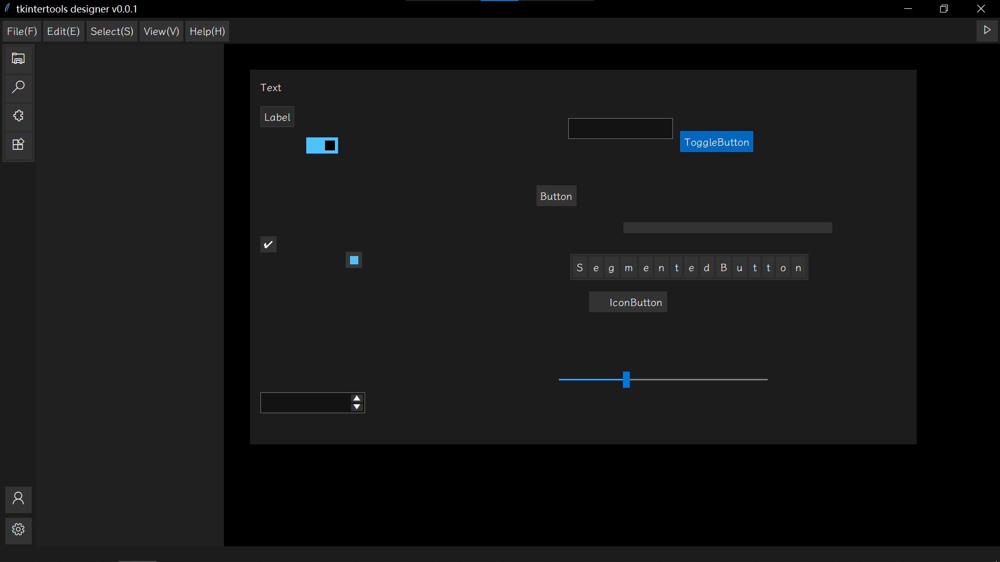

<h1 align="center">tkintertools designer</h1>

<code>tkintertools</code> 的官方设计器软件
 
The official designer software of <code>tkintertools</code>

    <a href="https://star-history.com/#Xiaokang2022/tkintertools-designer&Date">
        <picture>
            <source media="(prefers-color-scheme: dark)" srcset="https://api.star-history.com/svg?repos=Xiaokang2022/tkintertools-designer&type=Date&theme=dark" />
            <source media="(prefers-color-scheme: light)" srcset="https://api.star-history.com/svg?repos=Xiaokang2022/tkintertools-designer&type=Date" />
            
        </picture>
    </a>

## Preview / 预览

